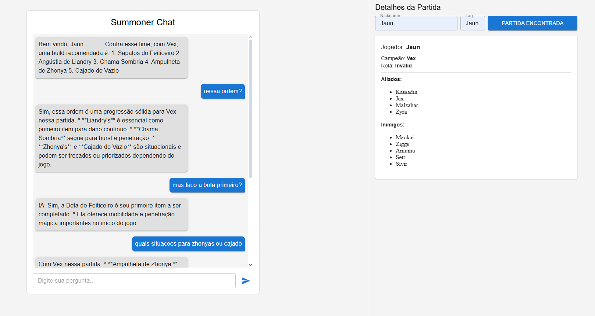

# summoner-chat

O **Summoner Chat** é uma aplicação web que integra dados do jogo **League of Legends (LoL)** com **inteligência artificial generativa**, oferecendo ao jogador sugestões táticas e builds personalizadas com base na sua partida.

---

## 🕹️ Sobre o jogo

**League of Legends** é um jogo multiplayer online de batalha em arenas (MOBA), onde duas equipes de cinco jogadores se enfrentam em partidas intensas. Cada jogador escolhe um **campeão** com habilidades únicas e ocupa uma **posição** no mapa (como top, jungle, mid, etc.). O sucesso no jogo depende de decisões estratégicas como **builds de itens**, **interação com o time**, e **respostas à composição inimiga**.

---

## 🧠 Objetivo do sistema

O **Summoner Chat** simula a experiência de ter um **coach de LoL baseado em IA**, que compreende o contexto da sua partida e fornece orientações de forma rápida e objetiva. O foco principal do projeto está na construção de um **back-end inteligente e flexível**, capaz de integrar:

- **Dados em tempo real da API da Riot Games**
- **Modelos de linguagem (LLMs)** para respostas em linguagem natural
- **Prompting dinâmico com contexto da partida**

---

## ⚙️ Como funciona

1. O usuário informa seu **nickname e tag** do jogo.
2. Ao clicar em **“Partida encontrada”**, o sistema consulta a **última partida recente** usando a API da Riot (por motivos de praticidade no teste, mas facilmente adaptável para partidas em tempo real).
3. O servidor coleta dados como:
   - Campeão escolhido
   - Posição (rota)
   - Aliados e inimigos na partida
4. Essas informações são organizadas em um prompt e enviadas para uma IA (LLM), que responde com **sugestões de build**, **estratégias** e **respostas a perguntas do jogador**.
5. O usuário interage com a IA por meio de um chat simples no front-end.

---

## 💡 Tecnologias utilizadas

### Back-end:

- **Node.js** com **Express**
- Integração com a **API da Riot Games** para obter dados de partida e jogador
- Integração com **Gemini (Google AI)** via API
- Estrutura modular com **controllers**, **routes** e separação de lógica

### Front-end:

- **React + TypeScript**
- **Material UI** para componentes visuais

> 🔁 A arquitetura permite o uso de **qualquer LLM via API**, como GPT-4, Claude ou até modelos locais como LLaMA com Ollama.

---

## 📌 Destaques do back-end

- 🧠 **Prompt dinâmico** com base no contexto real da partida
- 📤 Endpoints organizados para envio de mensagens (`/chat`) e mensagem inicial (`/chat/welcome`)
- 💬 Comunicação contínua com a IA usando o histórico da conversa
- 🛠️ Facilidade para troca de modelo de linguagem sem reestruturar totalmente o sistema

## 📷 Imagem do sistema

> _Exemplo da interface do Summoner Chat em funcionamento._

---
